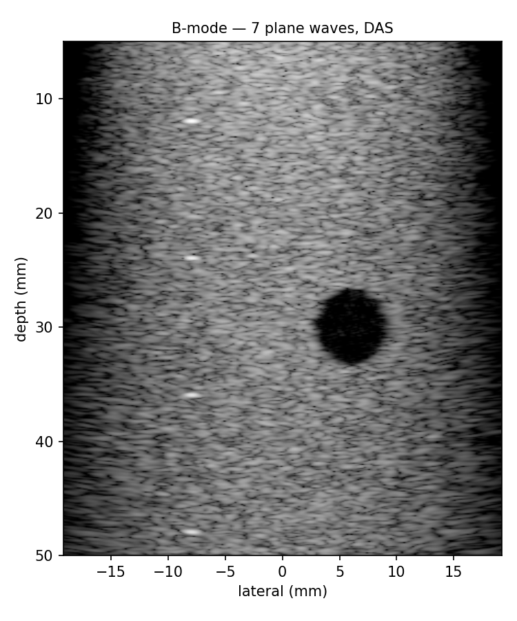
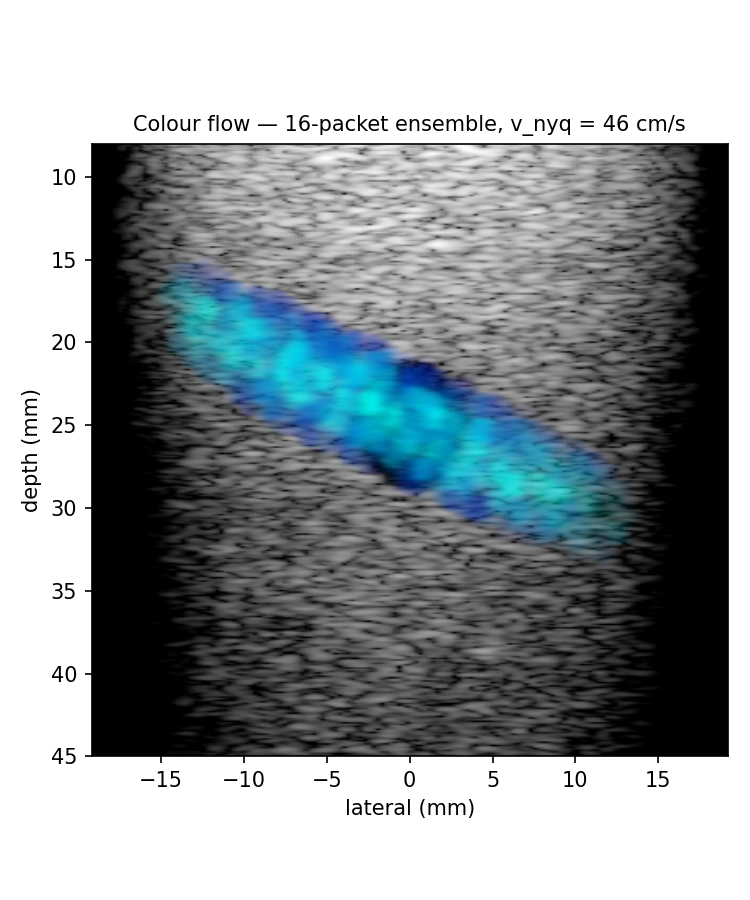
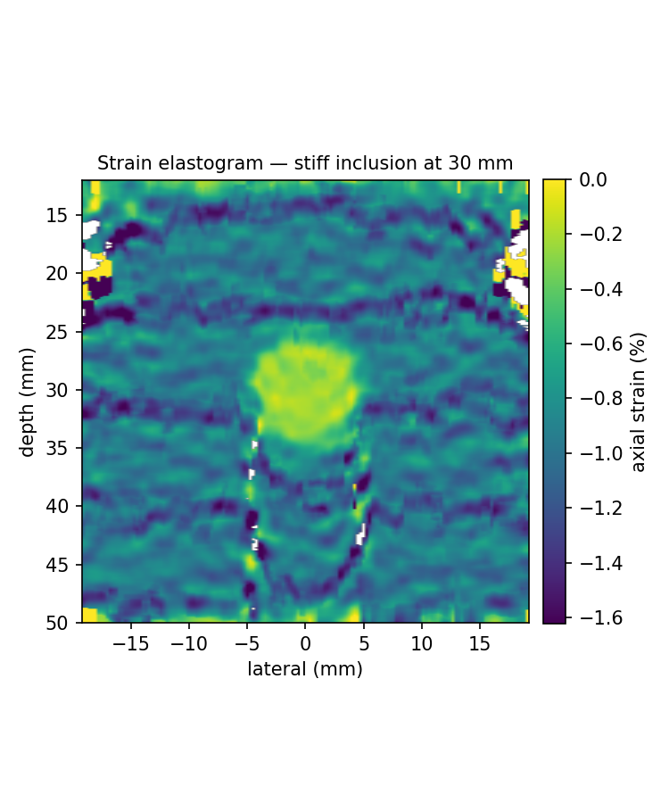
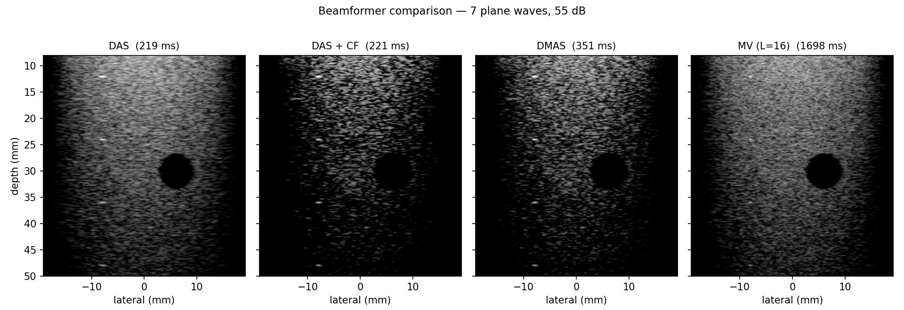

# usx — an ultrasound imaging engine, built from scratch

A real-time ultrasound imaging engine written from first principles: raw
per-element RF in, live complex images out, with the quantitative estimators
(Doppler, elastography) that those images are the input to.

The C++ core does the acoustics, beamforming and estimation; Python drives it,
ingests data, measures image quality and renders. Nothing here wraps an existing
imaging library — the delay laws, the demodulator, the beamformers, the wall
filter and the velocity estimators are all implemented directly, and the code is
written to be read.

There is no hardware requirement. A point-scatterer acoustic simulator ships with
the engine, so the whole pipeline runs, tests and benchmarks from a clean
checkout with known ground truth — which is also what makes the test suite able
to assert on physics rather than on "it didn't crash".



*Seven compounded plane waves through a speckle phantom with an anechoic cyst at
30 mm and wire targets down the left. Measured speckle SNR 1.95 against the
Rayleigh value of 1.91; measured lateral resolution 0.82 mm at 5 MHz.*

| | |
|---|---|
|  |  |
| **Colour flow.** A vessel at 25°, 16-pulse ensemble. The parabolic velocity profile is visible across the lumen; the surrounding tissue is fully rejected by the clutter filter and the coherence gate. | **Strain elastography.** A stiff inclusion (4× the background) at 30 mm, imaged under 1 % compression. Stiff tissue strains less, so it reads bright. Measured stiffness contrast 4.7×. |



*The same acquisition through four combiners. See
[why the metrics matter more than the pictures](docs/THEORY.md#7-judging-a-beamformer)
— the coherence factor's spectacular −93 dB contrast comes with a speckle SNR of
0.89, meaning it destroyed the texture along with the clutter.*

## What it does

**Imaging**

- Focused line-by-line, steered plane-wave, and diverging-wave transmits, with
  the delay laws derived rather than tabulated.
- Quadrature demodulation to complex baseband IQ, with decimation.
- Delay-and-sum beamforming with a dynamic, f-number-limited receive aperture
  and coherent plane-wave compounding.
- Two adaptive beamformers: **DMAS** (delay-multiply-and-sum) and **minimum
  variance** (Capon, with spatial smoothing and diagonal loading), plus
  coherence-factor weighting.
- Envelope detection, TGC, log compression, and polar-to-Cartesian scan
  conversion for sector formats.

**Quantitative** — the reason the engine's output is complex IQ and not a picture

- Colour flow with a polynomial-regression clutter filter and the Loupas 2-D
  autocorrelation velocity estimator.
- Power Doppler.
- Sub-wavelength axial displacement tracking and least-squares strain
  estimation, for elastography.

**Measurement** — because "looks sharper" is not a result

- CNR, gCNR, contrast, speckle SNR, and point-spread-function FWHM/sidelobe
  measurement, so beamformer changes are argued with numbers.

## Quick start

```bash
cmake -S . -B build -DCMAKE_BUILD_TYPE=Release
cmake --build build -j
export PYTHONPATH=$PWD/python

python -m usx bmode      # simulate a phantom, beamform, write a B-mode image
python -m usx compare    # DAS vs coherence factor vs DMAS vs minimum variance
python -m usx doppler    # colour and power Doppler on a flow phantom
python -m usx strain     # strain elastography on a stiff inclusion
python -m usx bench      # time the pipeline

./build/usx_tests        # C++ physics tests
pytest tests/            # Python-level tests
```

The forward simulation is the slow part of the demos, not the imaging pipeline: a
speckle phantom has tens of thousands of scatterers and the simulator sums every
element's contribution at each one, which takes a minute or two. The beamforming
that follows takes milliseconds — see [docs/PERFORMANCE.md](docs/PERFORMANCE.md).

## The API in twenty lines

```python
import usx, numpy as np

probe  = usx.presets.linear_5mhz()
medium = usx.Medium()
acq    = usx.presets.acquisition(probe, depth=0.05)

sim     = usx.Simulator(probe, medium, acq)
phantom = usx.phantoms.cyst_phantom(probe, medium)
txs     = sim.make_plane_waves(usx.angles_deg(-9, 9, 11))

raw  = sim.simulate(txs, phantom)          # (11, 128, N) float32 RF — zero-copy view
grid = usx.grid_for(probe, 0.005, 0.05, 256, 640)

pipe  = usx.ImagingPipeline(grid)
frame = pipe.process_frame(raw)            # complex64 (256, 640) — keep this
print(pipe.stats)                          # per-stage timing

bmode = usx.to_bmode(frame)                # only now is phase discarded
env   = np.asarray(usx.envelope(frame))
print(usx.metrics.summarize(env, grid, lesion_xz=(0.0, 0.020), lesion_radius=0.003))
```

## Where the raw data comes from

Every source implements the same two-method protocol, so the simulator and a
future scanner are interchangeable:

```python
class RawSource:
    metadata -> (Probe, Medium, Acquisition, list[Transmit])
    frames() -> iterator of ChannelData
```

`SimulatedSource` synthesises data from a phantom, `FileSource` replays a
self-describing `.npz` recording, and `ArraySource` adapts any in-memory
`(events, channels, samples)` array — which is the class to subclass when
bringing up real hardware or loading a public dataset such as PICMUS. Nothing
downstream of the source knows or cares which one it is.

## Design decisions worth knowing about

**The engine's output is complex IQ, not an image.** Log-compressed greyscale is
the end of the line: once phase is gone there is no Doppler, no speckle
tracking, no coherent compounding and no speed-of-sound estimation. Display is a
consumer of the frame, not the frame itself.

**One source of truth for geometry.** `usx/geometry.hpp` holds the delay laws,
and both the simulator and the beamformer call it. A timing bug therefore shows
up as a failing test rather than as an image that is uniformly, plausibly
slightly out of focus.

**The simulator does not use the beamformer's wavefront model.** The beamformer
assumes an idealized wavefront; the simulator sums each element's true
contribution, so it reproduces diffraction, finite-aperture effects and edge
waves that the idealization ignores. That asymmetry is deliberate — it means
beamforming simulated data actually tests the delay model instead of confirming
itself.

**Metrics are reported together.** The adaptive beamformers are non-linear and
can improve contrast while destroying the speckle texture a reader depends on.
`usx compare` prints resolution, contrast, gCNR *and* speckle SNR side by side
for exactly that reason — see [docs/THEORY.md](docs/THEORY.md#judging-a-beamformer).

## Documentation

- [docs/THEORY.md](docs/THEORY.md) — the physics and the mathematics, worked
  through: wave propagation, delay laws, the `t = 0` convention, why IQ, the
  beamformers, Doppler, elastography, and an honest list of what is not modelled.
- [docs/ARCHITECTURE.md](docs/ARCHITECTURE.md) — how the pieces fit, what the
  data structures are, and where to add things.
- [docs/PERFORMANCE.md](docs/PERFORMANCE.md) — measured timings, where the cost
  is, what was optimised and why, and what a GPU port would actually buy.

## Repository layout

```
core/include/usx/    public headers — the engine's interface and its reasoning
core/src/            implementation
core/tests/          C++ physics tests and the benchmark
bindings/            pybind11 module (zero-copy numpy views, GIL released)
python/usx/          the Python package: ingest, phantoms, presets, metrics,
                     render, CLI
tests/               pytest suite
examples/            worked scripts
docs/                THEORY, ARCHITECTURE, PERFORMANCE
```

## Status and limitations

This is a learning-first build that is also meant to be presentable, and the
scope cuts are deliberate and documented rather than hidden. In brief: the
acoustic model is linear (so no harmonic imaging), 2-D in the imaging plane
(elevation is modelled only as a fixed aperture), assumes a homogeneous speed of
sound (so no aberration), and has no multiple scattering. The engine is CPU-only.
The full list, with what each omission would take to fix, is at the end of
[docs/THEORY.md](docs/THEORY.md#what-is-not-modelled).

## Licence

MIT.
